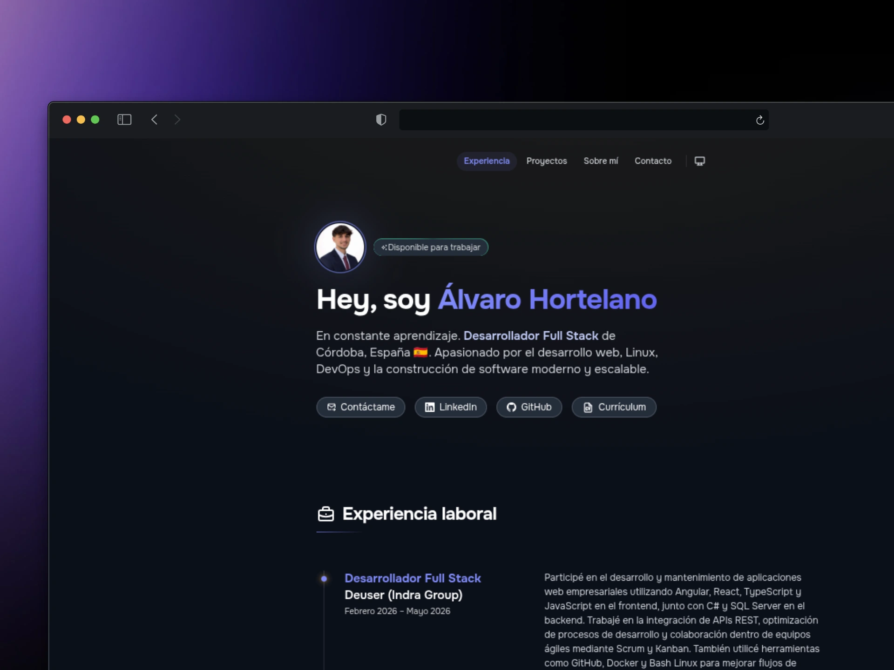

# 👨🏻‍💻 Porfolio para programadores y desarrolladores

<div align="center">
<a href="https://porfolio.dev/">

</a>
<p></p>
</div>

<div align="center">


# 👨🏻‍💻 Portfolio | Álvaro Hortelano Fernández

<div align="center">
  <a href="https://alvarohortelanofernandez.github.io/porfolio/">
    
  </a>

  <h3>Desarrollador Web</h3>

  <p>
    Portfolio personal desarrollado con <strong>Astro</strong> y <strong>Tailwind CSS</strong>,
    donde presento mi perfil, los proyectos en los que he trabajado y las tecnologías con las que desarrollo aplicaciones web.
  </p>

  <p>
    <a href="https://alvarohortelanofernandez.github.io/porfolio">
      🌐 Ver Portfolio
    </a>
  </p>
</div>

---

## 🚀 Sobre el proyecto

Este portfolio reúne toda mi información profesional en un único lugar. Su objetivo es servir como carta de presentación, mostrando quién soy, las tecnologías que utilizo, los proyectos que he desarrollado y las distintas formas de contactar conmigo.

Además, este proyecto me permite seguir aprendiendo y experimentar con nuevas herramientas, cuidando tanto el rendimiento como el diseño y la experiencia de usuario.

---

## ✨ Características

- ⚡ Desarrollado con Astro para obtener el máximo rendimiento.
- 🎨 Diseño moderno utilizando Tailwind CSS.
- 📱 Totalmente responsive.
- 🌙 Interfaz limpia y enfocada en la experiencia de usuario.
- 💼 Sección de proyectos con enlaces a GitHub y demostraciones.
- 👨🏻‍💻 Presentación personal y stack tecnológico.
- 📬 Información de contacto.

---

## 🛠️ Tecnologías

<div align="center">

| Tecnología   | Uso                  |
| ------------ | -------------------- |
| Astro        | Framework principal  |
| Tailwind CSS | Estilos              |
| TypeScript   | Lógica del proyecto  |
| Git          | Control de versiones |
| GitHub Pages | Despliegue           |

</div>

---

## 📦 Instalación

```bash
# Clonar el repositorio
git clone https://github.com/alvarohortelanofernandez/porfolio.git

# Entrar en el proyecto
cd porfolio

# Instalar dependencias
npm install

# Ejecutar en desarrollo
npm run dev
```

Para generar la versión de producción:

```bash
npm run build
```

---

## 📂 Estructura

```text
├── public/
├── src/
│   ├── components/
│   ├── layouts/
│   ├── pages/
│   ├── styles/
│   └── assets/
├── astro.config.mjs
└── package.json
```

---

## 🎯 Objetivos

- Mostrar mi experiencia y proyectos.
- Centralizar mi perfil profesional.
- Compartir las tecnologías con las que trabajo.
- Continuar mejorando mis conocimientos en desarrollo web.

---

## 🌐 Demo

👉 **https://alvarohortelanofernandez.github.io/porfolio/**

---

## 📬 Contacto

- GitHub: **@alvarohortelanofernandez**
- LinkedIn: _(añádelo aquí)_
- Portfolio: **alvarohortelanofernandez.github.io/porfolio**

---

<div align="center">

⭐ Si te gusta el proyecto, puedes dejar una estrella en el repositorio.

</div>
